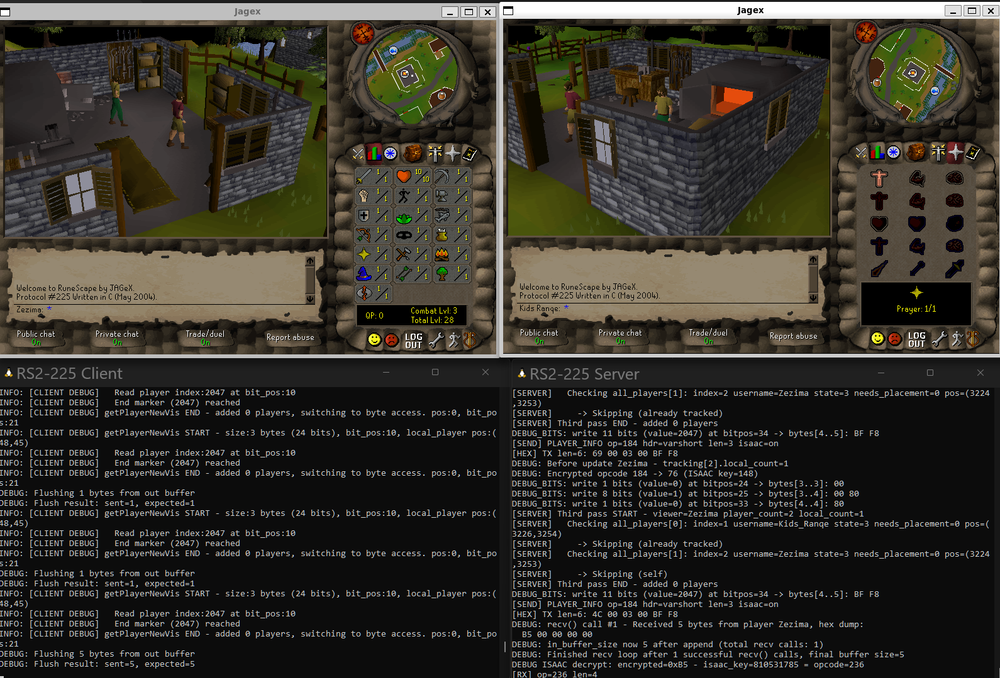

<div align="center">


**RuneScape Protocol #225 (May 18 2004)**  
**Language: C99**

Connect with [C99 RS2 #225 Client](https://github.com/ruminator2/RS2-225C-Client)

</div>



---

## Features

**Multiplayer** • Synchronized player state across concurrent connections  
**Persistence** • Binary save/load with CRC32 integrity  
**Movement** • Delta-encoded pathfinding with walk/run  
**Security** • ISAAC cipher packet obfuscation  
**Protocol** • Bit-packed viewport updates

## Technical

**Coordinates** • 32-bit packed (14-bit X, 14-bit Z, 2-bit level)  
**Network** • Big-endian TCP, non-blocking I/O  
**Tick Rate** • 600ms game loop, 1ms network poll  
**Memory** • Stack-allocated, minimal heap  
**Platform** • Linux, Windows, WSL

## Build

**Linux/WSL**
```bash
make clean && make -j4
```

**Windows**
```bash
mingw32-make clean && mingw32-make -j4
```

## Run

```bash
./bin/rs225
```

Default port: **43594**

## Docker

```yaml
services:
  rs225:
    image: ghcr.io/andrewpaglusch/rs225-c:main
    container_name: rs225
    restart: unless-stopped
    ports:
      - "43594:43594"
    volumes:
      - ./players:/app/data/players
```

## Paths

```
data/players/   - Player saves
data/maps/      - Map regions  
data/archives/  - Cache data
bin/rs225       - Server binary
```

### Disclaimer
> This project is an **educational prototype** created to study C game server–client architecture. It is **not affiliated with, endorsed by, or sponsored by Jagex Ltd.** “RuneScape®” and “Old School RuneScape®” are **registered trademarks of Jagex Ltd.**
